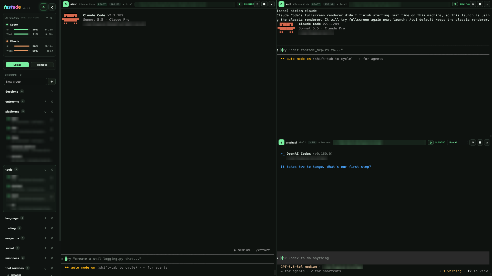

# fastade

A desktop client for running and managing Codex CLI, Claude Code, and Gemini CLI sessions in one place.

> This project is in early development. Data formats and features may change without notice.



## Features

- Create, restore, and manage terminal sessions on local machines or SSH servers
- Run Codex CLI, Claude Code, and Gemini CLI with configurable default models
- Per-session terminal pop-out windows with activity status and memory usage
- Codex and Claude Code usage display
- Optional read-only MCP integration to query the state of all sessions

## Requirements

- The AI CLIs you want to use (Codex CLI, Claude Code, Gemini CLI) must be installed and signed in separately.
- MCP integration works only on macOS and Linux. The bridge uses Unix sockets for local IPC, and Windows named-pipe support is not implemented yet.

## Building

Prebuilt installers are not provided. Build on the platform you are targeting: Windows installers on Windows, Linux packages on Linux, and the macOS app on macOS. Run the commands below from the repository root.

Common requirements:

- [Git](https://git-scm.com/downloads)
- Node.js 22.12 or later in the 22.x line, or Node.js 24 or later, with npm
- Rust 1.88 or later with Cargo. Installing the stable toolchain via [rustup](https://rustup.rs/) is recommended.

Clone the repository and install the JavaScript dependencies. `npm ci` installs the exact versions in the lockfile.

```bash
git clone https://github.com/kowanaceo/fastade.git
cd fastade
npm ci
```

### Windows

1. Install the [Microsoft C++ Build Tools](https://visualstudio.microsoft.com/visual-cpp-build-tools/) and select the **Desktop development with C++** workload.
2. Install the Evergreen Bootstrapper of the [Microsoft Edge WebView2 Runtime](https://developer.microsoft.com/en-us/microsoft-edge/webview2/#download-section). It is usually already present on Windows 10 (1803 and later) and Windows 11.
3. Open a new PowerShell and build:

```powershell
rustup default stable-msvc
npm run check
npm run tauri:build
```

Installers are generated at:

- MSI: `apps\desktop\src-tauri\target\release\bundle\msi\`
- NSIS installer (`.exe`): `apps\desktop\src-tauri\target\release\bundle\nsis\`

### Linux (Ubuntu/Debian)

First install the Tauri 2 WebKitGTK and system build dependencies:

```bash
sudo apt update
sudo apt install libwebkit2gtk-4.1-dev \
  build-essential \
  curl \
  wget \
  file \
  libxdo-dev \
  libssl-dev \
  libayatana-appindicator3-dev \
  librsvg2-dev
```

Then build:

```bash
npm run check
npm run tauri:build
```

Packages are generated under `apps/desktop/src-tauri/target/release/bundle/` in the `deb/`, `rpm/`, and `appimage/` directories. For other distributions such as Fedora or Arch, see the [Tauri 2 Linux prerequisites](https://v2.tauri.app/start/prerequisites/#linux).

### macOS

The Xcode Command Line Tools are enough; full Xcode is not required.

```bash
xcode-select --install
npm run check
npm run tauri:build
```

Outputs:

- App bundle: `apps/desktop/src-tauri/target/release/bundle/macos/fastade.app`
- Disk image: `apps/desktop/src-tauri/target/release/bundle/dmg/`

### Development

```bash
npm run tauri:dev
```

Running in a browser alone is not supported. The frontend talks to the Rust host through Tauri IPC, so use `npm run tauri:dev`.

To run the checks:

```bash
npm run check
cd apps/desktop/src-tauri && cargo test
```

### Google sign-in (optional)

Sign-in is disabled unless the build includes a Google OAuth client of type "Desktop app". Provide it through the `GOOGLE_OAUTH_CLIENT_ID` and `GOOGLE_OAUTH_CLIENT_SECRET` environment variables, or the git-ignored `.secrets/google-oauth-desktop.json`, when building. Never commit these credentials.

## Usage guide

See the usage guide for shortcuts and key features: [한국어](docs/USAGE.ko.md) · [English](docs/USAGE.en.md)

## AI CLI integration and security

When you enable MCP integration in settings, fastade adds a `fastade_mcp` entry to the user configuration files of the corresponding CLI.

| CLI | User config files modified | Status detection |
| --- | --- | --- |
| Codex | `~/.codex/config.toml`, `~/.codex/hooks.json` | Lifecycle hooks for turns, tool runs, approval requests, and interrupt/completion, plus turn-complete notifications |
| Claude Code | `~/.claude.json`, `~/.claude/settings.json` | Hooks for sessions, turns, tool runs, approval requests, completion/failure, and user-input notifications |
| Gemini CLI | `~/.gemini/settings.json` | Inferred from terminal output |

fastade removes only the entries it created and leaves your existing settings intact. Codex may not run new hooks immediately: open `/hooks` in Codex and review and trust the hooks fastade added, otherwise the working/idle status will not be accurate.

SSH passwords are stored in the OS secure storage.

## Project structure

```text
apps/desktop/  Svelte 5 + TypeScript + Tauri 2 desktop app
SPEC.md        Product and UX specification
```

## Contributing

See [CONTRIBUTING.md](CONTRIBUTING.md).

## License

[MIT](LICENSE)
